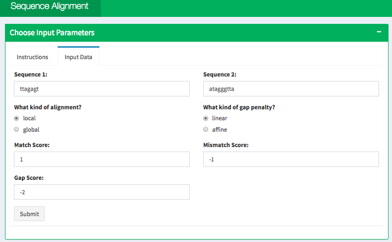
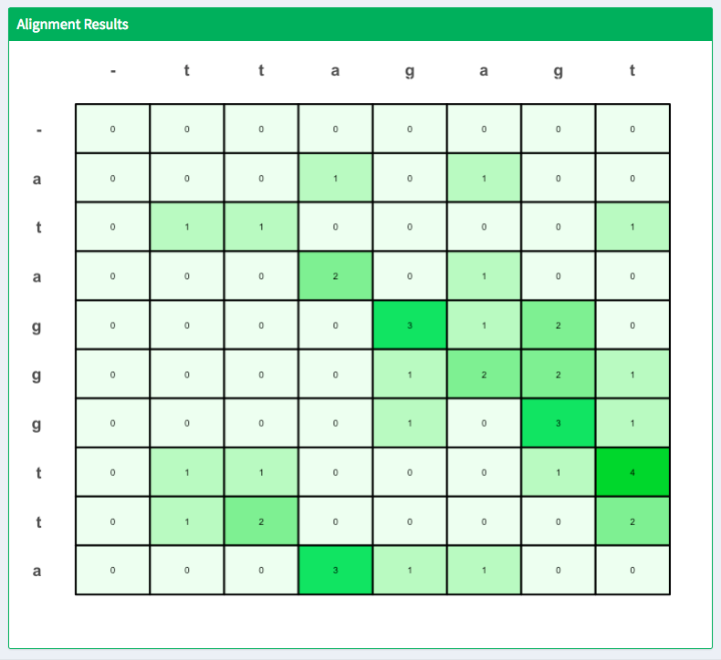
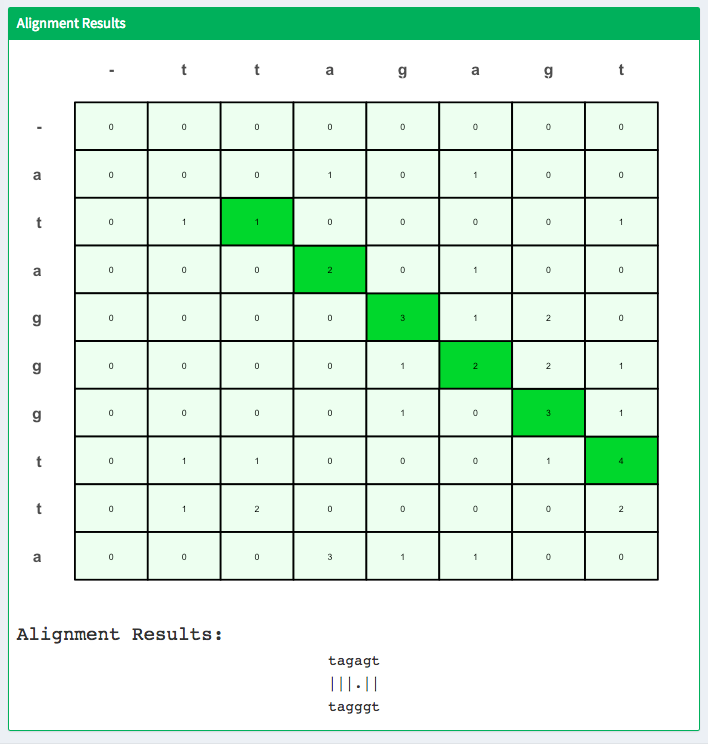

# Sequence Alignment Visualization

## Check it Out!

[Run the app](https://jennifernguyen.shinyapps.io/sequence_alignment_visualization/)

## Quick Summary

This R Shiny application visualizes the Smith-Waterman/Needleman-Wunsch sequence alignment algorithm. These algorithms are used to align two sequences. It is commonly used to match DNA sequences. This is the R implementation of a [project I did for Bioinformatics 576](https://github.com/jennguyen1/bioinformatics_576/tree/master/gene_alignment) (originally in Python). A detailed description of the algorithm is available in instructions tab of the app.

Activate the algorithm by clicking on the Submit button. The dynamic programming matrix will appear in the plot below.

Click on any cell in the plot to find the corresponding best alignment, plot will reset if there is no best alignment from that cell. 

Click anywhere in the margins of the plot to reset the plot.
