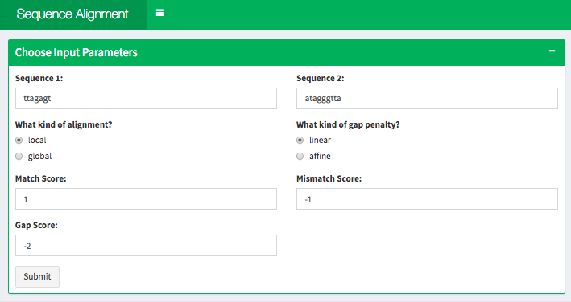
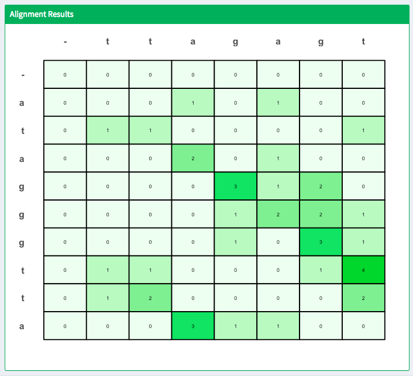

# Sequence Alignment Visualization

## Check it Out!

[Run the app here.](https://jennynguyen.shinyapps.io/sequence_alignment_visualization/)

## Quick Summary

This R Shiny application visualizes the Smith-Waterman/Needleman-Wunsch sequence alignment algorithm. These algorithms are used to align two sequences. It is commonly used to match DNA sequences. This is the R implementation of a [project I did for Bioinformatics 576](https://github.com/jennguyen1/bioinformatics_576/tree/master/gene_alignment) (originally in Python).

A more detailed set of instructions are available in instructions tab of the app.

-- FROM APP --
This is an interactive shiny visualization of the Smith-Waterman/Needleman-Wunsch sequence alignment algorithm. These algorithms are used to align two sequences. It is commonly used to match DNA sequences.

The match score is added if two elements match. The mismatch score is the penalty if two elements do not match.

The alignment may be local (Smith Waterman algorithm) or global (Needleman-Wunsch algorithm). Global alignment finds the best match between entire sequences. Local alignment finds the best match between substrings of the two sequences.

The gap penalty is the penalty for introducing gaps into a sequence. Affine gap penalties have a gap score, the penalty for opening a gap, and a space score, the penalty for extending a gap. Linear gap penalties treat each gap the same.

Activate the algorithm by clicking on the Submit button. The dynamic programming matrix will appear in the plot below. Click on any cell in the plot to find the corresponding best alignment, plot will reset if there is no best alignment from that cell. Click anywhere in the margins of the plot to reset the plot.
